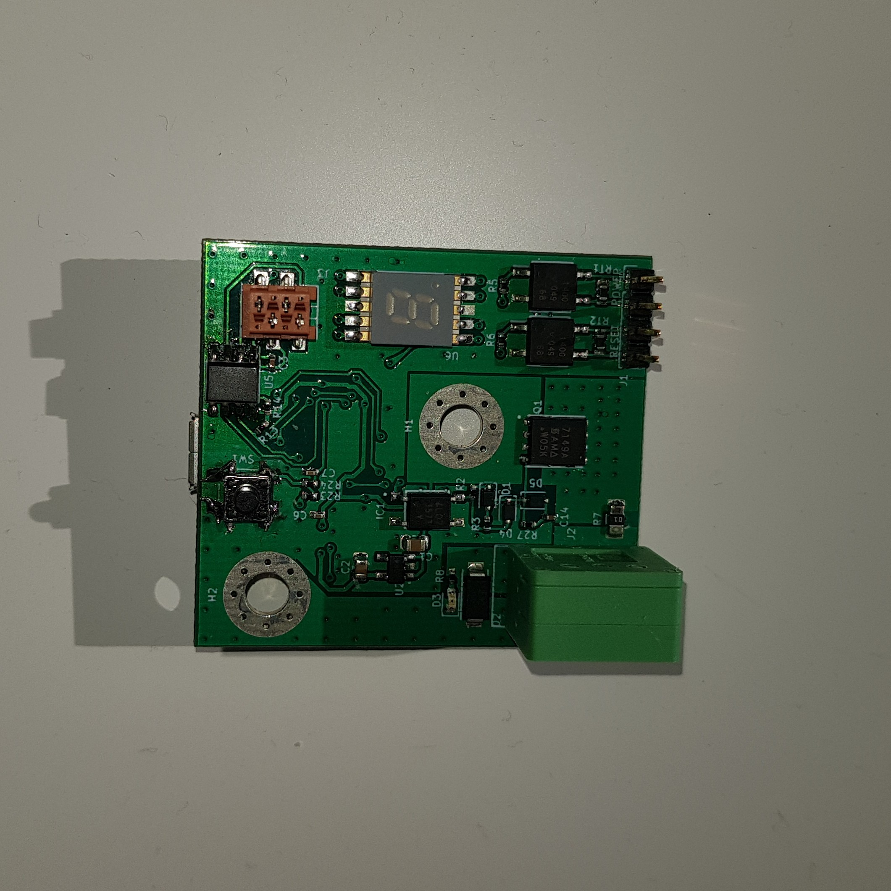
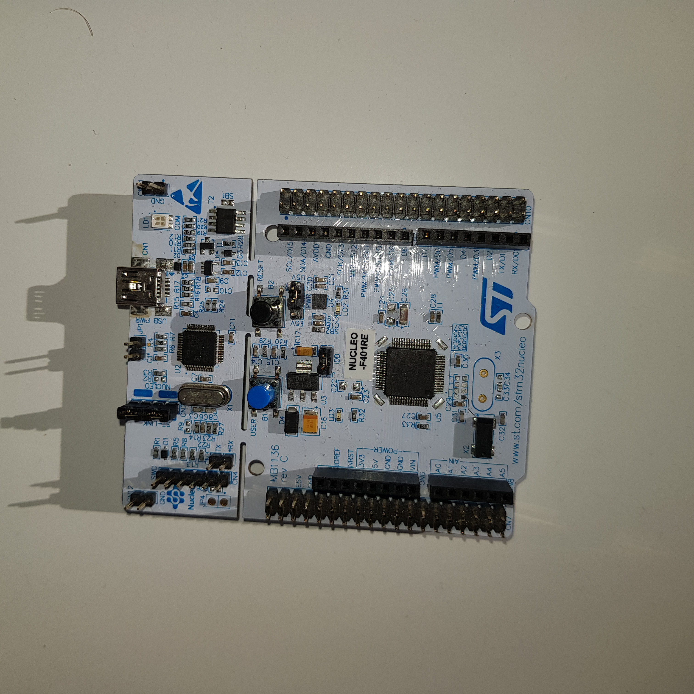

%Stage chez Qarnot
%Mathieu Chan
%03 Septembre 2021

# Présentation de Qarnot
  - taille de l'entreprise
  - section (qlab, qhardware, qnetwork...)
  - organigramme (photo)
  - objectif de qarnot
  - produit proposé (photos)

# étape d'apprentissage
  1. Documentation (beaucoup)
  2. prise en main de la programmation système
    - allumage d'une LED
    - clignotement d'une LED
    - maintien d'un bouton
  3. début des missions

# Missions
  - mettre en place un système de debug pour une qmate 
  - communication entre une nucleo et une qmate grâce au protocol i2c 

<figure> 

<figcaption> <b>Illustration 1</b> une qmate </figcaption>
</figure>

<figure> 

<figcaption> <b>Illustration 2</b> une STM32 nucleo-F401RE </figcaption>
</figure>

# Compétences acquises
  - travail en équipe
  - compétences techniques en programmation pour le système embarqué
  - compétences en C
  - outil de versionnage (mainly garder un historique propre...)
  - culture générale en informatique

# Difficulté
  - apprendre le système embarqué (notamment certaines règles)
  - coder selon les règles imposés
  - écrire un code propre pour soi et pour les autres
  - créer un code le plus portable possible selon leur utilisation
